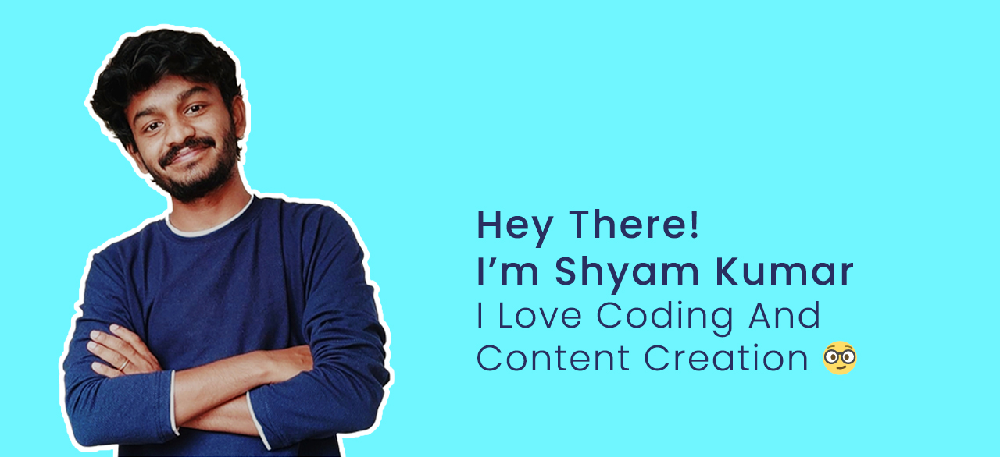

### Hi there 👋

Hi, I'm Shyam Kumar, a passionate self-taught frontEnd web developer from India.

* :grin: **I'm a Student Developer**.
* :office: **Currently working as**:  
    1. :raised_hands: Intern at <a href="http://the-brainy-homes.netlify.app/">The Brainy Homes</a>. 
    2. :v: Contributor at <a href="https://devincept.tech/">DevIncept</a>.  
    3. 👯 Student Partner at <a href="https://internshala.com">Internshala</a> & Face of <a href="http://jntuacea.ac.in/">Jawaharlal Technological University<a/>, Anantapuramu.
    
* 💬  **Ask me about anything** <a href="https://github.com/ShyamKumar1/ShyamKumar1/issues">Here<a/>
  
 
- :email: **Write me on** : shyam.ceolife@gmail.com

- 📫 **How to reach me**:

  &nbsp;&nbsp;&nbsp;&nbsp;
  &nbsp;&nbsp;&nbsp;&nbsp;
  &nbsp;&nbsp;&nbsp;&nbsp;
  &nbsp;&nbsp;&nbsp;&nbsp;

* :1st_place_medal: **Skills**
    1. Operating System - Windows, Linux, Mac OS

    2. Programming Languages - C, C++, Python, Java, JavaScript, Kotlin (Intermediate)

    3. Web/Mobile App Dev - Android, Flutter, HTML5, CSS, Bootstrap, SQL, Node JS, PHP, MongoDB

    4. Technologies and Frameworks – React, spring, Django, Express.
    5. Softwares– Photoshop, Figma, Dreamviewer, Adobe XD, 

>NOTE: Top languages does not indicate my skill level or something like that, it's a github metric of which languages i have the most code on github, it's a new feature of github-readme-stats.
  

 <b>From 11/25/2020</b>
